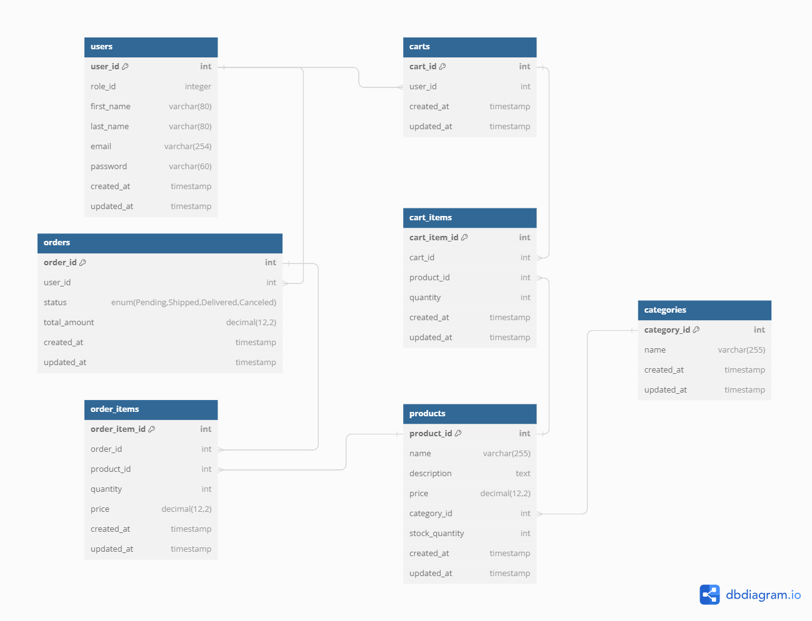

# Olakada Samuel - Ecommerce API

This project is being built to have the Basic and important aspects of an e-commerce application.

<!-- ## Table of contents

- [Olakada Samuel - Ecommerce API](#olakada-samuel---ecommerce-api)
  - [Table of contents](#table-of-contents)
  - [Overview](#overview)
    - [The challenge](#the-challenge)
    - [Screenshot](#screenshot)
    - [Links](#links)
  - [My process](#my-process)
    - [Built with](#built-with)
    - [What I learned](#what-i-learned)
    - [Continued development](#continued-development)
    - [Useful resources](#useful-resources)
  - [Author](#author)
  - [Acknowledgments](#acknowledgments) -->

## Overview

### The challenge

Users should be able to:

- Authenticate
  - Register into the app
  - Login
  - Login via OAuth (Google and Facebook)
- Cart
  - View their cart
  - Add products to their cart
  - Delete a product from their cart
  - Clear the entire cart
- Products
  - View products
  - Add products to cart
  - Filter Product by category
- Make Orders
  - Place an order
  - Review and Edit their orders
  - Delete their order
  - See order status

### Screenshot



### Links

- Solution URL: [Solution on github](https://github.com/olakadasami/mini-e-comm-api.git)
<!-- - Live Site URL: [Add live site URL here](https://your-live-site-url.com) -->

## My process

### Built with

- Typescript
- [Adonisjs](https://adonisjs.com/) - Javascript backend framework

<!-- ### What I learned

Use this section to recap over some of your major learnings while working through this project. Writing these out and providing code samples of areas you want to highlight is a great way to reinforce your own knowledge.

To see how you can add code snippets, see below:

```html
<h1>Some HTML code I'm proud of</h1>
```

```css
.proud-of-this-css {
  color: papayawhip;
}
```

```js
const proudOfThisFunc = () => {
  console.log('🎉')
}
``` -->

<!-- If you want more help with writing markdown, we'd recommend checking out [The Markdown Guide](https://www.markdownguide.org/) to learn more.

**Note: Delete this note and the content within this section and replace with your own learnings.**

### Continued development

Use this section to outline areas that you want to continue focusing on in future projects. These could be concepts you're still not completely comfortable with or techniques you found useful that you want to refine and perfect.

**Note: Delete this note and the content within this section and replace with your own plans for continued development.** -->

### Useful resources

- [AdonisJs Docs](https://www.adonisjs.com) - Beautiful documentation of the AdonisJs framework
- [Lucid Orm docs](https://lucid.adonisjs.com/docs/introduction) - This is the documentation of @adonisjs team's orm called lucid
- [Adocasts Website](https://adocasts.com/) - Adocasts has tutorials for adonisjs that is easy to understand and very rich, from authentication/authorization and beyond

<!-- **Note: Delete this note and replace the list above with resources that helped you during the challenge. These could come in handy for anyone viewing your solution or for yourself when you look back on this project in the future.** -->

## Author

- Website - [Samuel Olakada](https://www.your-site.com)
- Twitter - [@olaks_codes](https://x.com/olaks_codes)
- LinkedIn - [@samuel_olakada](https://www.linkedin.com/in/samuel-olakada/)

<!-- **Note: Delete this note and add/remove/edit lines above based on what links you'd like to share.** -->

## Acknowledgments

<!-- This is where you can give a hat tip to anyone who helped you out on this project. Perhaps you worked in a team or got some inspiration from someone else's solution. This is the perfect place to give them some credit.

**Note: Delete this note and edit this section's content as necessary. If you completed this challenge by yourself, feel free to delete this section entirely.** -->
